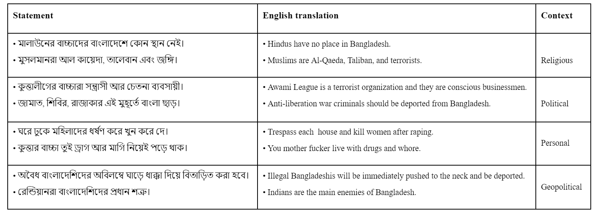
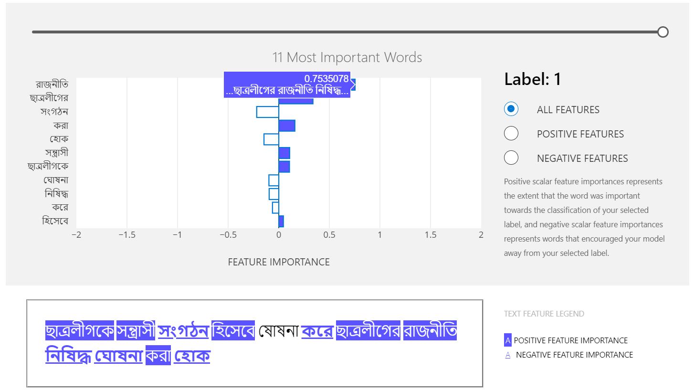
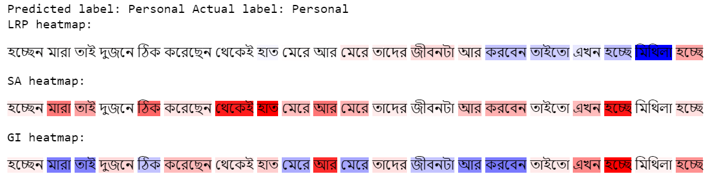

### DeepHateExplainer: Explainable Hate Speech Detection in Under-resourced Bengali Language
<p align="justify">Code and supplementary materials for our paper "DeepHateExplainer: Explainable Hate Speech Detection in Under-resourced Bengali Language" (Proceeding of IEEE International Conference on Data Science and Advanced Analytics~(DSAA'2021), October 6-9, 2021, Porto, Portugal). This repo will be updated with more reproducable resources, e.g., models, notebooks, etc.</p>

### Methods ###
<p align="justify"> In this paper, we propose an explainable approach for hate speech detection from under-resourced Bengali language, which we called DeepHateLingo. In our approach, Bengali texts are first comprehensively preprocessed, before classifying them into political, personal, geopolitical, and religious hates with a neural ensemble method of transformer architectures (i.e., Bangla BERT-base, multilingual BERT, and XLM-RoBERTa). Important (most and least) terms are then identified using sensitivity analysis and layer-wise relevance propagation (LRP), before providing human-interpretable explanations of individual predictions. Besides, we compute comprehensiveness and sufficiency scores to measure quality of explanations w.r.t faithfulness.</p>

### Folder structure ###
~~~
./input/new_data     --> Contains the dataset related files.
./preprocess  	      --> Contains the codes for preprocessing the dataset.	
./results            --> Contain the evaluation result based on test dataset.
./notebooks          --> Contains some examples covering interpretability and ensemble prediction. 
./training-script    --> Contains the codes for all transformer-based classifiers.
~~~

### Dataset ###
<p align="justify"> We follow a bootstrap approach for data collection, where specific types of texts containing common slurs and terms, either directed towards a specific person or entity or generalized towards a group, are only considered. Texts were collected from Facebook, YouTube comments, and newspapers. We categorize the samples into political, personal, geopolitical, and religious hate. Three annotators (a linguist, a native Bengali speaker, and an NLP researcher) participated in the annotation process.</p> 

:warning: *This repository contains some extremely offensive contents. Following are a few examples!* 
<p align="center"></p>

<p align="justify"> To reduce possible bias, unbiased contents are supplied to the annotators and each label was assigned based on a majority voting on the annotator's independent opinions. To evaluate the quality of the annotations and to ensure the decision based on the criteria of the objective, we measure inter-annotator agreement w.r.t Cohen's Kappa statistic. Overall, our Bengali Hate Speech Dataset are available as CSV files and categorized observations into political, personal, geopolitical, and religious. Examples are distributed across following hate types: </p> 

| Hate type  | # of examples | 
| ---       |---     |
|Personal| 3513|
|Geopolitical| 2364|
|Religious| 1211|
|Political| 999|
| Total | 8087

Then, we split the samples into train (5,887), validation (1,000), test (1,200) sets. 
 
### Code usage instructions ### 
First clone this repo and move to the directory. Then, install necessary libraries. Also, following commands can be used: 
~~~
$ git clone https://github.com/AwesomeDeepAI/DeepHateLingo.git
$ cd DeepHateLingo/ 
$ sudo pip3 install -r requirements.txt
~~~
For training BERT variants, [BERT](https://huggingface.co/transformers/model_doc/bert.html) and
[XLMRoberta](https://huggingface.co/transformers/model_doc/xlmroberta.html) like tokenizations are used. In the `params`, make sure to set `pretrained_model_name` used BERT variants and XLMRoberta based models in [Huggingface](https://huggingface.co/). 

```
python3 ./training-script/bangla-bert-base/train.py --bert_hidden 768 \
    --epochs 6 \
    --pretrained_model_name "sagorsarker/bangla-bert-base" \
    --learning_rate 3e-5 \
    --max_len 128 \
    --dropout 0.3 \
    --train_batch_size 16 \
    --valid_batch_size 32 \
    --model_layer "last_two" \
    --model_specification "bangla-bert-training" \
    --output "six_bangla_bert_last_two_pred_3e5.csv"

python3 ./training-script/bangla-bert-base/train.py --bert_hidden 768 \
    --epochs 6 \
    --pretrained_model_name "bert-base-multilingual-cased" \
    --learning_rate 2e-5 \
    --max_len 128 \
    --dropout 0.3 \
    --train_batch_size 16 \
    --valid_batch_size 32 \
    --model_layer "last_four" \
    --model_specification "bert-base-multilingual-cased-training" \
    --output "six_bert_base_multilingual_cased_last_four_pred_2e5.csv"

python3 ./training-script/bangla-bert-base/train.py --bert_hidden 768 \
    --epochs 6 \
    --pretrained_model_name "bert-base-multilingual-uncased" \
    --learning_rate 5e-5 \
    --max_len 128 \
    --dropout 0.3 \
    --train_batch_size 16 \
    --valid_batch_size 32 \
    --model_layer "last_two" \
    --model_specification "bert-base-multilingual-uncased-training" \
    --output "six_bert_base_multilingual_uncased_last_two_pred_5e5.csv"

python3 ./training-script/xlm-roberta/train.py --roberta_hidden 1024 \
    --epochs 5 \
    --pretrained_model_name "xlm-roberta-large" \
    --learning_rate 2e-5 \
    --max_len 128 \
    --train_batch_size 16 \
    --valid_batch_size 32 \
    --model_layer "pool_output" \
    --model_specification "xlm-roberta-large-training" \
    --output "five_xlm_roberta_pool_pred_2e5.csv"
```
The default parametrs provided in the shell scripts can also be used. Networks will be trained on CPU by default, if GPU is not available. For training baseline DNN models such as LSTM, please refer to corresponding [notebook](notebooks/LRP_BiLSTM_FastText_Embbeddings_4_Class.ipynb). This requires pretrained FastText embedding model, which can be downloaded from [here](https://github.com/AwesomeDeepAI/DeepHateLingo/blob/main/models/Bengali_FastText_DIM20.zip). Then, make sure to unzip it and make sure to set the path properly. Please note that a smaller version is provived here as the size of a FastText embedding model with dimension 300 is huge. However, we plan to provide all the pretrained and fine-tuned language models in coming weeks. 

### Results ###
<p align="justify">For standalone models, plase refer to 'result' folder. The following result is based on <a name=https://github.com/AwesomeDeepAI/DeepHateLingo/blob/main/notebooks/Ensemble_prediction.ipynb>Ensemble</a> 
prediction of RoBERTa, Bangla-BERT-base, and mBERT-uncased. Please note the following class encoding to interprete the class-specific classification reports:</p>
 
-	Personal hate: class 0
-	Political hate: class 1
-	Religius hate: class 2
-	Geopolitical hate: class 3 

```
Accuracy:: 0.8766666666666667
Precision:: 0.8775601042666743
Recall:: 0.8766666666666667
F1-score:: 0.8763746343903924
MCC:: 0.8205216999232595
---------------------------------------------------------
Class-wise classification report:: 
               precision    recall  f1-score   support

           0       0.91      0.90      0.91       524
           1       0.82      0.74      0.78       157
           2       0.79      0.90      0.84       159
           3       0.89      0.89      0.89       360

    accuracy                           0.88      1200
   macro avg       0.85      0.86      0.85      1200
weighted avg       0.88      0.88      0.88      1200
----------------------------------------------------------
```
### Examples ###
The following example is based on interpret_text library. Please refer to corresponding [notebook](notebooks/Example_interpret_text.ipynb) for more detail. 
<p align="center"></p>

The following example is based on LRP, SA, GI. Please refer to corresponding [notebook](notebooks/LRP_BiLSTM_FastText_Embbeddings_4_Class.ipynb) for more detail. 
<p align="center"></p>

### Citation request ###
If you use the code of this repository in your research, please consider citing the folowing papers:

    @inproceedings{DeepHateLingo,
        title={DeepHateLingo: Explainable Hate Speech Detection in Under-resourced Bengali Language},
        author={Anonymous for review},
        conference={submitted to 8th IEEE International Conference on Data Science and Advanced Analytics (IEEE DSAA,2021)},
        year={2021}
    }

### Contributing ###
In future, we'll provide an email address, in case readers have any questions.
